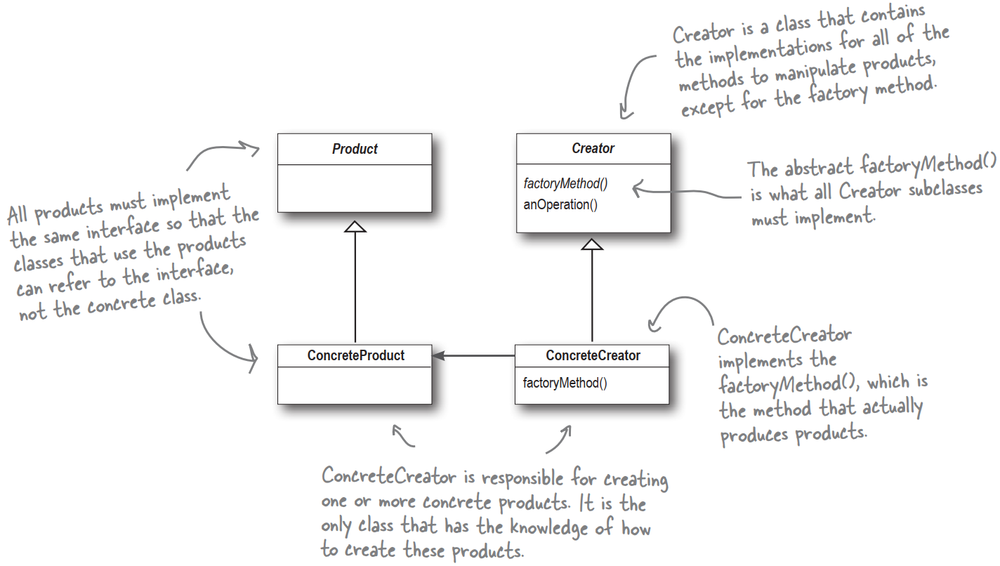

# clarification about FactoryMethod
>As with every factory, the Factory Method Pattern gives us a way to encapsulate the
instantiations of concrete types. Looking at the class diagram below, you can see that the
abstract Creator class gives you an interface with a method for creating objects, also known
as the “factory method.” Any other methods implemented in the abstract Creator are
written to operate on products produced by the factory method. Only subclasses actually
implement the factory method and create products.
As in the official definition, you’ll often hear developers say, “the Factory Method pattern
lets subclasses decide which class to instantiate.” Because the Creator class is written without
knowledge of the actual products that will be created, we say “decide” not because the
pattern allows subclasses themselves to decide, but rather, because the decision actually comes
down to which subclass is used to create the product.
